### 기타 그래프 이론

#### 서로소 집합 자료구조
- 서로소 집합이란 공통 원소가 없는 두 집합을 의미한다
    - {1,2}와 {3,4}는 서로소 관계이다
    - {1,2}와 {2,3}은 서로소 관계가 아니다
- 서로소 부분 집합들로 나누어진 원소들의 데이터를 처리하기 위한 자료구조
- 서로소 집합 자료구조는 두 종류의 연산을 지원한다
    - 합집합(Union) : 두 개의 원소가 포함된 집합을 하나의 집합으로 합치는 연산
    - 찾기(Find) : 특정한 원소가 속한 집합이 어떤 집합인지 알려주는 연산
- 서로소 집합 자료구조는 합치기 찾기(Union Find) 자료구조라고 불리기도 한다
- 여러 개의 합치기 연산이 주어졌을 때 서로소 집합 자료구조의 동작 과정은 다음과 같다
1. 합집합(Union) 연산을 확인하여, 서로 연결된 두 노드 A,B를 확인한다
    1) A와 B의 루트 노드 A', B'를 각각 찾는다
    2) A'를 B'의 부모 노드로 설정한다
2. 모든 합집합(Union) 연산을 처리할 때까지 1번의 과정을 반복한다    

- 처리할 연산들 : Union(1,4), Union(2,3), Union(2,4), Union(5,6)
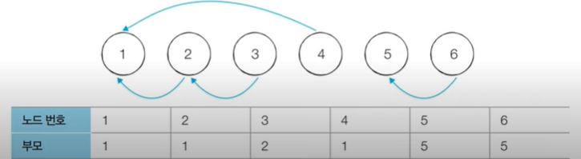

```
# 특정 원소가 속한 집합을 찾기
def find_parent(parent, x):
    # 루트 노드를 찾을 때까지 재귀 호출
    if parent[x] != x:
        return find_parent(parent, parent[x])
    return x

# 두 원소가 속한 집합을 합치기
def union_parent(parent, a, b):
    a = find_parent(parent, a)
    b = find_parent(parent, b)
    if a < b:
        parent[b] = a
    else:
        parent[a] = b
        
# 노드의 개수와 간선(Union 연산)의 개수 입력 받기
v,e = map(int, input().split())
parent = [0] * (v+1) # 부모 테이블 초기화하기

# 부모 테이블상에서, 부모를 자기 자신으로 초기화
for i in range(1, v+1):
    parent[i] = i
    
# Union 연산을 각각 수행
for i in range(e):
    a,b = map(int, input().split())
    union_parent(parent, a, b)
    
# 각 원소가 속한 집합 출력하기
print("각 원소가 속한 집합 : ", end="")
for i in range(1, v+1):
    print(find_parent(parent, i), end=" ")

print()

# 부모 테이블 내용 출력하기
print("부모 테이블 : ", end="")
for i in range(1, v+1):
    print(parent[i], end=" ")
```

#### 서로소 집합 자료구조 : 기본적인 구현 방법의 문제점
- 합집합(Union) 연산이 편향되게 이루어지는 경우 찾기(Find) 함수가 비효율적으로 동작한다
- 최악의 경우에는 찾기(Find) 함수가 모든 노드를 다 확인하게 되어 시간 복잡도가 O(V)이다
    - 다음과 같이 {1,2,3,4,5}의 총 5개의 원소가 존재하는 상황을 확인해보자
    - 수행된 연산들 : Union(4,5), Union(3,4), Union(2,3), Union(1,2)
    

   
#### 서로소 집합 자료구조 : 경로 압축
- 찾기(Find) 함수를 최적하하기 위한 방법으로 경로 압축(Path Compression)을 이용할 수 있다
    - 찾기(Find) 함수를 재귀적으로 호출한 뒤에 부모 테이블 값을 바로 갱신한다
```
# 특정 원소가 속한 집합을 찾기
def find_parent(parent, x)
    # 루트 노드가 아니라면, 루트 노드를 찾을 때까지 재귀적으로 호출
    if parent[x] != x:
        parent[x] = find_parent(parent, parent[x])
    return parent[x]    
```    
- 경로 압축 기법을 적용하면 각 노드에 대하여 찾기(Find) 함수를 호출한 이후에 해당 노드의 루트 노드가
바로 부모 노드가 된다
- 동일한 예시에 대해서 모든 합집합(Union) 함수를 처리한 후 각 원소에 대해서 찾기(Find) 함수를
수행하면 다음과 같이 부모 테이블이 갱신된다
- 기본적인 방법에 비하여 시간 복잡도가 개선된다

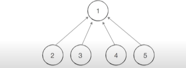
  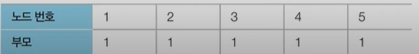

```
# 특정 원소가 속한 집합을 찾기
def find_parent(parent, x):
    # 루트 노드를 찾을 때까지 재귀 호출
    if parent[x] != x:
        parent[x] = find_parent(parent, parent[x])
    return parent[x]

# 두 원소가 속한 집합을 합치기
def union_parent(parent, a, b):
    a = find_parent(parent, a)
    b = find_parent(parent, b)
    if a < b:
        parent[b] = a
    else:
        parent[a] = b
        
# 노드의 개수와 간선(Union 연산)의 개수 입력 받기
v,e = amp(int, input().split())
parent = [0] * (v+1) # 부모 테이블 초기화

# 부모 테이블상에서, 부모를 자기 자신으로 초기화
for i in range(1, v+1):
    parent[i] = i

# Union 연산을 각각 수행
for i in range(e):
    a,b = map(int, input().split())
    union_parent(parent, a, b)
    
# 각 원소가 속한 집합 출력하기
print('각 원소가 속한 집합 : ', end=" ")
for i in range(1, v+1):
    print(find_parent(parent, i), end=" ")
    
print()

# 부모 테이블 내용 출력하기
print("부모 테이블 : ", end="")
for i in range(1, v+1):
    print(parent[i], end=" ")
```

#### 서로소 집합을 활용한 사이클 판별
- 서로소 집합은 무방향 그래프 내에서의 사이클을 판별할 때 사용할 수 있다
    - 참고로 방향 그래프에서의 사이클 여부는 DFS를 이용하여 판별할 수 있다
- 사이클 판별 알고리즘은 다음과 같다
    1. 각 간선을 하나씩 확인하며 두 노드의 루트 노드를 확인한다
        1. 루트 노드가 서로 다르다면 두 노드에 대해 합집합(Union) 연산을 수행한다
        2. 루트 노드가 서로 같다면 사이클(Cycle)이 발생한 것이다
    2. 그래프에 포함되어 있는 모든 간선에 대해 1번 과정을 반복한다

#### 서로소 집합을 활용한 사이클 판별 : 동작 과정 살펴보기
- [초기 단계] 모든 노드에 대하여 자기 자신을 부모로 설정하는 형태로 부모 테이블을 초기화한다
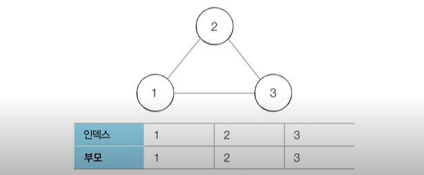
  
```
# 특정 원소가 속한 집합을 찾기
def find_parent(parent, x):
    # 루트 노드를 찾을 때까지 재귀 호출
    if parent[x] != x:
        parent[x] = find_parent(parent, parent[x])
    return parent[x]


# 두 원소가 속한 집합을 합치기
def union_parent(parent, a, b):
    a = find_parent(parent, a)
    b = find_parent(parent, b)
    if a < b:
        parent[b] = a
    else:
        parent[a] = b


# 노드의 개수와 간선(Union 연산)의 개수 입력 받기
v, e = amp(int, input().split())
parent = [0] * (v + 1)  # 부모 테이블 초기화

# 부모 테이블상에서, 부모를 자기 자신으로 초기화
for i in range(1, v + 1):
    parent[i] = i

cycle = False # 사이클 발생 여부

for i in range(e):
    a,b = map(int, input().split())
    # 사이클이 발생한 경우 종료
    if find_parent(parent, a) == find_parent(parent, b):
        cycle = True
        break
    # 사이클이 발생하지 않았다면 합집합(Union) 연산 수행
    else:
        union_parent(parent, a, b)
        
if cycle:
    print("사이클이 발생했습니다")
else:
    print("사이클이 발생하지 않았습니다")
```
#### 신장 트리
- 그래프에서 모든 노드를 포함하면서 사이클이 존재하지 않는 부분 그래프를 의미한다
    - 모든 노드가 포함되어 서로 연결되면서 사이클이 존재하지 않는다는 조건은 트리의 조건이기도 하다
      


##### 최소 신장 트리
- 최소한의 비용으로 구성되는 신장 트리를 찾아야 할 때 어떻게 해야 할까?
- 예를 들어 N개의 도시가 존재하는 상황에서 두 도시 사이에 도로를 놓아 전체 도시가 서로 연결될 수 있게 도로를 설치하는 경우를 생각해 보자
    - 두 도시 A,B를 선택했을 때 A에서 B로 이동하는 경로가 반드시 존재하도록 도로를 설치한다
    
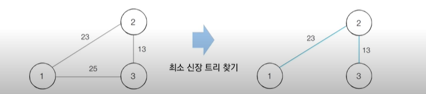

#### 크루스칼 알고리즘
- 대표적인 최소 신장 트리 알고리즘이다
- 그리디 알고리즘으로 분류된다
- 구체적인 동작 과정은 다음과 같다
    1. 간선 데이터를 비용에 따라 오름차순으로 정렬한다
    2. 간선을 하나씩 확인하며 현재의 간선이 사이클을 발생시키는지 확인한다
        1. 사이클이 발생하지 않는 경우 최소 신장 트리에 포함시킨다
        2. 사이클이 발생하는 경우 최소 신장 트리에 포함시키지 않는다
    3. 모든 간선에 대하여 2번의 과정을 반복한다

- [초기 단계] 그래프의 모든 간선 정보에 대하여 오름차순 정렬을 수행한다
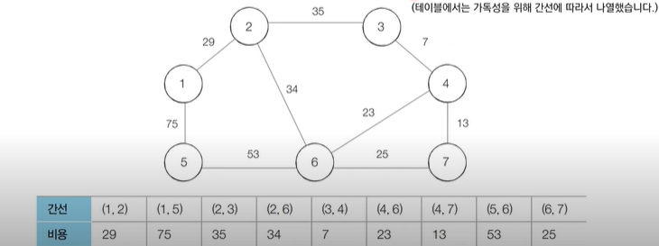
  
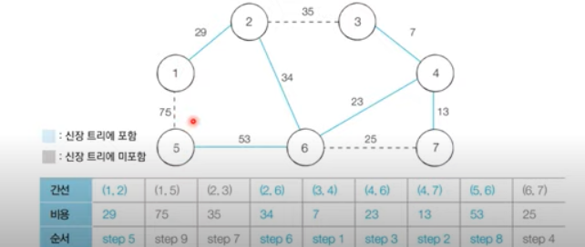

- [알고리즘 수행 결과]
    - 최소 신장 트리에 포함되어 있는 간선의 비용만 모두 더하면, 그 값이 최종 비용에 해당한다
    
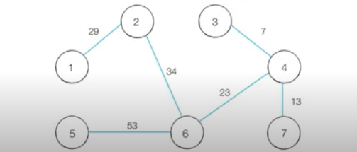

```
# 특정 원소가 속한 집합을 찾기
def find_parent(parent, x):
    # 루트 노드를 찾을 때까지 재귀 호출
    if parent[x] != x:
        parent[x] = find_parent(parent, parent[x])
    return parent[x]


# 두 원소가 속한 집합을 합치기
def union_parent(parent, a, b):
    a = find_parent(parent, a)
    b = find_parent(parent, b)
    if a < b:
        parent[b] = a
    else:
        parent[a] = b


# 노드의 개수와 간선(Union 연산)의 개수 입력 받기
v, e = amp(int, input().split())
parent = [0] * (v + 1)  # 부모 테이블 초기화

# 모든 간선을 담을 리스트와, 최종 비용을 담을 변수
edges = []
result = 0

# 부모 테이블상에서, 부모를 자기 자신으로 초기화
for i in range(1, v+1):
    parent[i] = i
    
# 모든 간선에 대한 정보를 입력 받기
for _ in range(e):
    a,b,cost = map(int, input().split())
    # 비용순으로 정렬하기 위해서 튜플의 첫 번째 원소를 비용으로 설정
    edges.append((cost, a, b))
    
# 간선을 비용순으로 정렬
edges.sort()

# 간선을 하나씩 확인하며
for edge in edges:
    cost, a, b = edge
    # 사이클이 발생하지 않는 경우에만 집합에 포함
    if find_parent(parent, a) != find_parent(parent, b):
        union_parent(parent, a, b)
        result += cost
        
print(result)
```

#### 크루스칼 알고리즘 성능 분석
- 크루스칼 알고리즘은 간선의 개수가 E개일 때, O(ElogE)의 시간 복잡도를 가진다
- 크루스칼 알고리즘에서 가장 많은 시간을 요구하는 곳은 간선을 정렬을 수행하는 부분이다
    - 표준 라이브러리를 이용해 E개의 데이터를 정렬하기 위한 시간 복잡도는 O(ElogE)이다
    
#### 위상 정렬
- 사이클이 없는 방향 그래프의 모든 노드를 방향성에 거스르지 않도록 순서대로 나열하는 것이다
- 예시) 선수과목을 고려한 학습 순서 설정
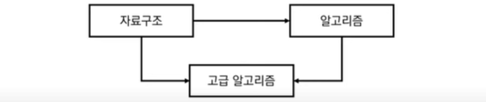
  
- 위 세 과목을 모두 듣기 위한 적절한 학습 순서는?
    - 자료구조 -> 알고리즘 -> 고급 알고리즘 (O)
    - 자료구조 -> 고급 알고리즘 -> 알고리즘 (X)
    
##### 진입차수와 진출차수
- 진입차수(Indegree) : 특정한 노드로 들어오는 간선의 개수
- 진출차수(Outdegree) : 특정한 노드에서 나가는 간선의 개수
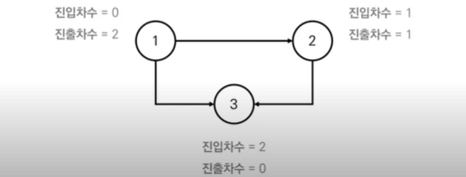
  
#### 위상 정렬 알고리즘
- 큐를 이용하는 위상 정렬 알고리즘의 동작 과정은 다음과 같다
    1. 진입차수가 0인 모든 노드를 큐에 넣는다
    2. 큐가 빌 때까지 다음의 과정을 반복한다
        1. 큐에서 원소를 꺼내 해당 노드에서 나가는 간선을 그래프에서 제거한다
        2. 새롭게 진입차수가 0이 된 노드를 큐에 넣는다
    
- 결과적으로 각 노드가 큐에 들어온 순서가 위상 정렬을 수행한 결과와 같다

#### 위상 정렬 동작 예시
- 위상 정렬을 수행할 그래프를 준비한다
    - 이때 그래프는 사이클이 없는 방향 그래프(DAG)여야 한다
      
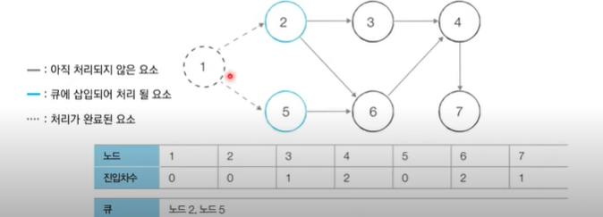
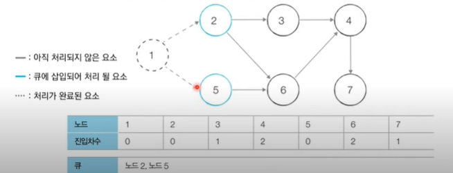
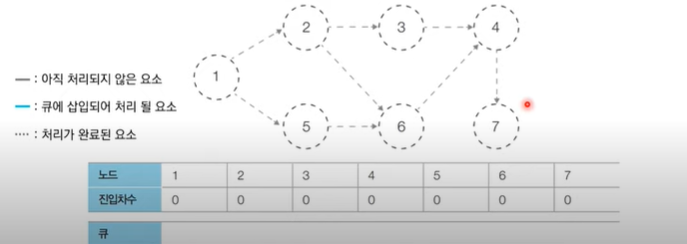

#### 위상 정렬의 특징
- 위상 정렬은 DAG에 대해서만 수행할 수 있다
    - DAG(Direct Acyclic Graph) : 순환하지 않는 방향 그래프
- 위상 정렬에서는 여러 가지 답이 존재할 수 있다
    - 한 단계에서 큐에 새롭게 들어가는 원소가 2개 이상인 경우가 있다면 여러 가지 답이 존재한다
- 모든 원소를 방문하기 전에 큐가 빈다면 사이클이 존재한다고 판단할 수 있다
    - 사이클에 포함된 원소 중에서 어떠한 원소도 큐에 들어가지 못한다
- 스택을 활용한 DFS를 이용해 위상 정렬을 수행할 수도 있다    

```
from collections import deque

# 노드의 개수와 간선의 개수를 입력 받기
v, e = map(int, input().split())
# 모든 노드에 대한 진입차수는 0으로 초기화
indegree = [0] * (v+1)
# 각 노드에 연결된 간선 정보를 담기 위한 연결 리스트 초기화
graph = [[] for i in range(v+1)]

# 방향 그래프의 모든 간선 정보를 입력 받기
for _ in range(e):
    a, b = map(int, input().split())
    graph[a].append(b) # 정점 A에서 B로 이동 가능
    # 진입 차수를 1 증가
    indegree[b] += 1
    
# 위상 정렬 함수
def topology_sort():
    result = [] # 알고리즘 수행 결과를 담을 리스트
    q = deque() # 큐 기능을 위한 deque 라이브러리 사용
    # 처음 시작할 때는 진입차수가 0인 노드를 큐에 삽입
    for i in range(1, v+1):
        if indegree[i] == 0:
            q.append(i)
    # 큐가 빌 때까지 반복
    while q:
        # 큐에서 원소 꺼내기
        now = q.popleft()
        result.append(now)
        # 해당 원소와 연결된 노드들의 진입차수에서 1 빼기
        for i in graph[now]:
            ingegree[i] -= 1
            # 새롭게 진입차수가 0이 되는 노드를 큐에 삽입
            if indegree[i] == 0:
                q.append(i)
    # 위상 정렬을 수행한 결과 출력
    for i in result:
        print(i, end=" ")
        
topology_sort()
```
#### 위상 정렬 알고리즘 성능 분석
- 위상 정렬을 위해 차례대로 모든 노드를 확인하며 각 노드에서 나가는 간선을 차례대로 제거해야 한다
    - 위상 정렬 알고리즘의 시간 복잡도는 O(V+E)이다
